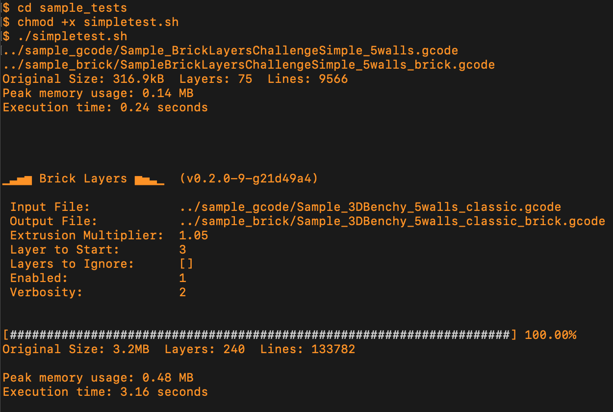

# BrickLayers for Cura
Interlocking Layers Post-Processing Script for Ultimaker Cura

## Video about this script:
[](https://www.youtube.com/watch?v=qqJOa46OTTs)

---
# Cura Integration: v1.0.0

This is the Cura-compatible version of the popular BrickLayers algorithm, originally designed for PrusaSlicer, OrcaSlicer, and BambuStudio. 

The integration provides seamless post-processing within Cura's native interface - no command line setup required!


---

## Installation

### Method 1: Manual Installation (Recommended)

1. **Download the files**: Download `BrickLayersCuraScript.py` and `bricklayers.py` from this repository
2. **Find Cura's scripts folder**: 
   - Open Ultimaker Cura
   - Go to **Help → Show Configuration Folder**
   - Navigate to the `scripts` subfolder
3. **Copy the files**: Place both files in the `scripts` folder
4. **Restart Cura**: Close and reopen Ultimaker Cura

### Method 2: Plugin Installation (Advanced)

For advanced users, you can package this as a proper Cura plugin by creating a `plugin.json` file and following Cura's plugin development guidelines.

---

## Setup in Cura

1. **Enable the script**:
   - In Cura, go to **Extensions → Post Processing → Modify G-Code**
   - Click **Add a script**
   - Select **BrickLayers** from the list


2. **Configure settings**:
   - **Enable BrickLayers**: Check to activate the script
   - **Start at layer**: Layer number to begin BrickLayers processing (default: 3)
   - **Extrusion multiplier**: Scaling factor for extrusion (default: 1.05)
   - **Layers to ignore**: Comma-separated list of layers to skip

3. **Slice and print**: Slice your model normally - BrickLayers will process the G-code automatically

### **Cura Settings Recommendations**:

For best results with BrickLayers in Cura:


**Print Settings:**
- **Layer Height**: 0.2mm or 0.3mm work well
- **Wall Line Count**: 2-4 walls recommended
- **Wall Ordering**: Any order works (Cura handles this automatically)
- **Infill**: Any infill pattern works

**Advanced Settings:**
- **Print Sequence**: "All at Once" (avoid "One at a Time")
- **Z Hop**: Enable for better travel moves

### **No Command Line Required!**

Unlike other slicers, Cura integration means:
- ✅ **No Python installation needed** - Cura handles everything
- ✅ **No path configuration** - Works out of the box
- ✅ **Native UI integration** - Configure through Cura's interface
- ✅ **Automatic processing** - Runs seamlessly during slicing

---

# How to see the Preview?

Unfortunately, like other slicers, Cura doesn't show post-processing changes automatically in the preview.

To see the BrickLayers modifications:
1. **Slice your model** with BrickLayers enabled
2. **Save the G-code** to a file
3. **Drag the G-code file back into Cura** to see the modified toolpaths

This limitation exists in all slicers and is not specific to the Cura integration.

More details: https://github.com/GeekDetour/BrickLayers/issues/20

---

## Command Line Interface (Optional)

While the Cura integration is the recommended approach, you can still use the script from command line if needed.

For command line usage examples, check the sample tests:
```sh
cd sample_tests
chmod +x simpletest.sh
./simpletest.sh
```

You should see something like this:


---

## Troubleshooting

### Common Issues

**Script not appearing in the list:**
- Ensure both files are in the correct `scripts` folder
- Restart Cura completely
- Check that file names are exactly: `BrickLayersCuraScript.py` and `bricklayers.py`

**Print quality issues:**
- Try reducing the extrusion multiplier to 1.02-1.03
- Increase the starting layer if first layers are problematic
- Check that your printer can handle the modified travel moves

**Processing takes too long:**
- This is normal for large files - BrickLayers processes every line of G-code
- Consider using fewer layers for testing

### Getting Help

If you encounter issues:
1. Check the Cura console for error messages
2. Try with a simple test model first
3. Verify your G-code contains the expected layer markers (`;LAYER:`)

---

## Technical Details

### How It Works
1. **G-code Analysis**: Parses the sliced G-code to identify wall segments
2. **Layer Redistribution**: Moves inner perimeter segments to create interlocking patterns
3. **Path Optimization**: Adjusts travel moves and retractions for the new layout
4. **Output Generation**: Produces modified G-code with BrickLayers enhancements

### Compatibility
- **Cura Version**: Tested with Cura 4.x and 5.x
- **G-code Format**: Standard Cura G-code with `;LAYER:` markers
- **Printers**: Compatible with any printer that works with Cura

---

## Credits

- **Original BrickLayers Algorithm**: [GeekDetour/BrickLayers](https://github.com/GeekDetour/BrickLayers)
- **Cura Integration**: Adapted for Ultimaker Cura compatibility
- **Patent**: The hexagonal 3D printing pattern is public domain (Batchelder: US005653925A, 1995)

## Support

If you find this useful, consider supporting the original BrickLayers development:
- [GeekDetour on Patreon](https://www.patreon.com/c/GeekDetour)

